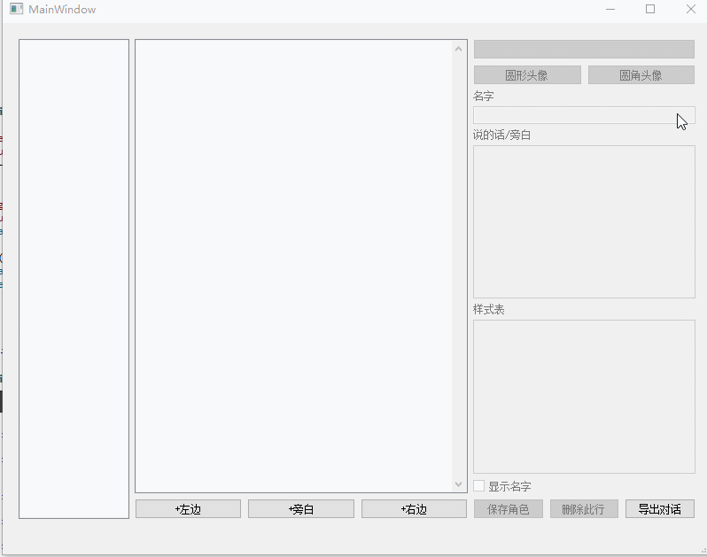

Qt 对话（剧本）编辑器
===

## 介绍

极其方便的对话编辑器。

类似 QQ、微信等界面

支持文本、对话互相转换

## 功能

- 从纯文字文章（小说）直接导入
- 导出为文章、TXT、图片
- 角色模板，一键保存，快速输入
- 便捷多选编辑、插入、排序
- 自由的界面，通过CSS设置
- 角色行表达式，支持QQ/微信/TIM文字消息直接粘贴

## 待办

- [ ] 发送图片、附件
- [ ] 自定义气泡图片（拉伸难办）
- [ ] 模拟顶部标题、底部输入框
- [ ] 更多属性设置，例如头像大小
- [ ] 更精准的对话导入算法

## 截图

